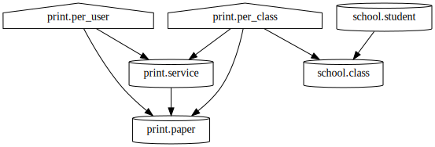

# SQL Dependency Extraction Tool

This tool extracts dependencies between database objects:
- views depend on tables or other views
- tables may have foreign keys

At the moment, [sqlgg](https://github.com/ygrek/sqlgg/)
can't parse all function calls and doesn't parse foreign keys at all,
so I've thrown together a small but naïve shell script to analyze SQL scripts
formatted [the way I write them](print.sql).

## Usage

Extract dependencies, optionally prepending a schema name:
```
$ ./sqldep print <print.sql |tee print.dep
TABLE print.paper:
TABLE print.service: print.paper
VIEW print.per_user: print.service print.paper
VIEW print.per_class: print.service print.paper school.class
```

Append dependencies extracted from another SQL script:
```
$ ./sqldep school <school.sql >>print.dep
```

Convert dependencies to a dot script,
then render it using [GraphViz](https://graphviz.org/):
```
$ utils/dep_to_dot.sh <print.dep |dot -Tsvg >print.svg
```


Convert dependencies to a dot script describing inter-schema dependencies,
then render it using [GraphViz](https://graphviz.org/):
```
$ (cd utils; ./dep_to_schema_dot.sh) <print.dep |dot -Tsvg >print_s.svg
```

