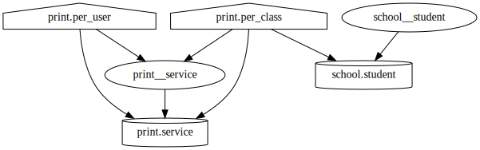
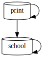

# SQL Dependency Extraction Tool

This tool extracts dependencies between database objects:
- views depend on tables or other views
- tables may have foreign keys

At the moment, [sqlgg](https://github.com/ygrek/sqlgg/)
can't parse all function calls and doesn't parse foreign keys at all,
so I've thrown together a small but naïve shell script to analyze SQL scripts
formatted [the way I write them](demo/print.sql).

## Usage

### Manual

Extract dependencies, optionally prepending a schema name:
```
$ ./sqldep print <demo/print/schema.sql |tee demo/data/print.dep
TABLE print.paper:
TABLE print.service: print.paper
VIEW print.per_user: print.service print.paper
VIEW print.per_class: print.service print.paper school.class
```

Extract dependencies from another SQL script:
```
$ ./sqldep school <demo/school/schema.sql >demo/data/school.dep
```

Concatenate dependency information:
```
$ cat demo/data/{print,school}.dep >demo/data/all.dep
```

Convert dependencies to a dot script,
then render it using [GraphViz](https://graphviz.org/):
```
$ utils/sqldep_to_dot <demo/data/all.dep |dot -Tsvg >demo/data/objects.svg
```


Convert dependencies to a dot script describing inter-schema dependencies,
then render it using [GraphViz](https://graphviz.org/):
```
$ (cd utils; ./sqldep_to_schema_dot) <demo/data/all.dep |dot -Tsvg >demo/data/schemata.svg
```


### Semi-automatic

```
$ cd demo/data
$ make
```
